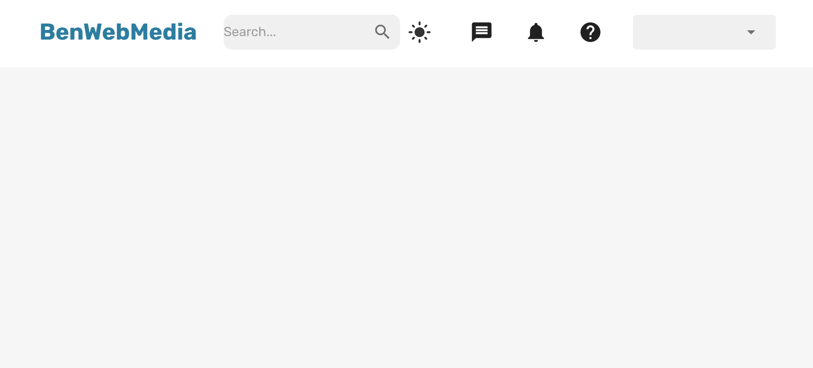

# SOCIAL MEDIA APP **BENWEBMEDIA** 

Creation of a social network application with `MERN` technologies.

          

#

- Dark Mode
- Likes
- List of friends

#

> ### Application still under development 👷 🚧

### Getting Started with Create React App

This project was bootstrapped with [Create React App](https://github.com/facebook/create-react-app).

#

## Available Scripts

In the project directory, you can run:

### `npm start`

Runs the app in the development mode.\
Open [http://localhost:3000](http://localhost:3000) to view it in your browser.

The page will reload when you make changes.\
You may also see any lint errors in the console.
